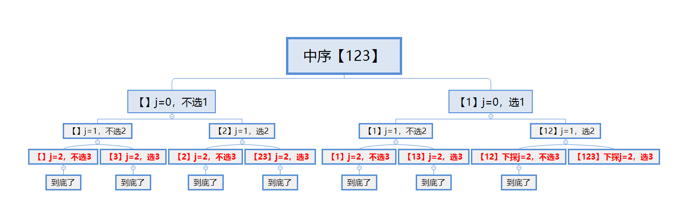
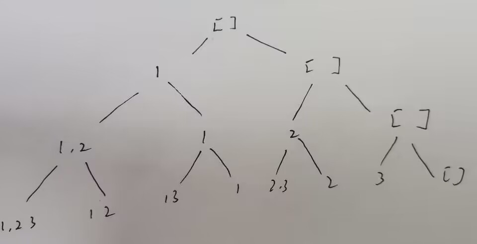

# LCR 079. 子集
给定一个整数数组 nums ，数组中的元素 互不相同 。返回该数组所有可能的子集（幂集）。
解集`不能`包含重复的子集。你可以按`任意顺序`返回解集。

示例 1：
输入：nums = [1,2,3]
输出：[[],[1],[2],[1,2],[3],[1,3],[2,3],[1,2,3]]
示例 2：
输入：nums = [0]
输出：[[],[0]]

提示：
- `1 <= nums.length <= 10`
- `-10 <= nums[i] <= 10`
- `nums`中的所有元素`互不相同`

注意：本题与主站 78 题相同： https://leetcode-cn.com/problems/subsets/

中序遍历图解1：

中序遍历图解2：

